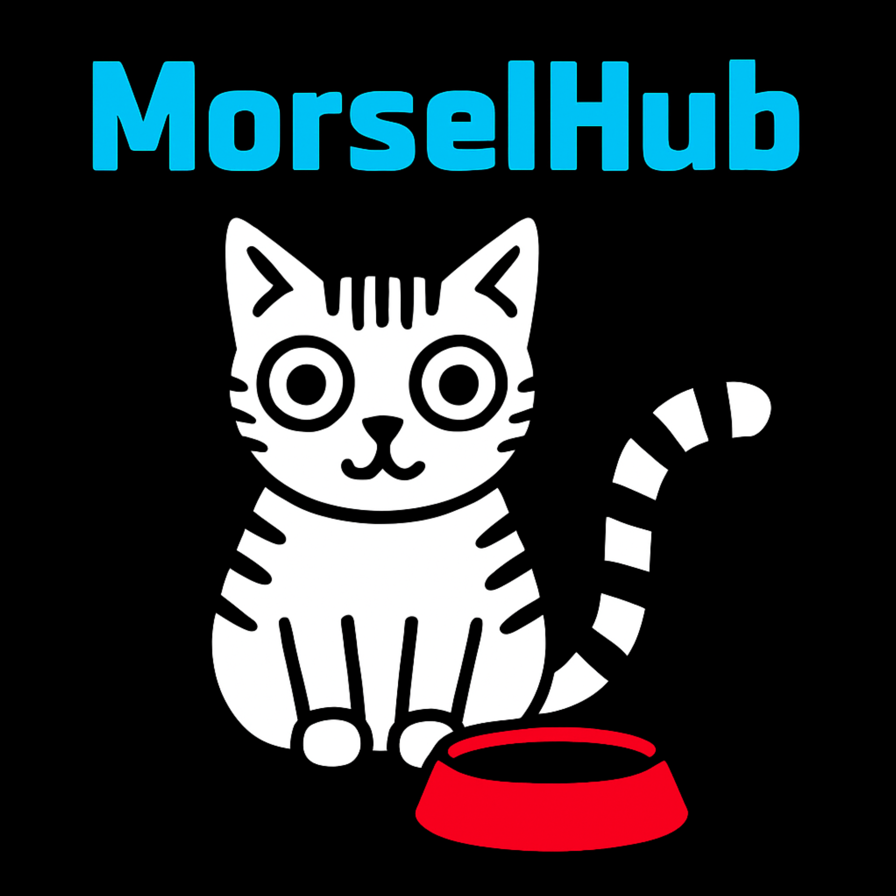

<p align="center">
  
</p>

<h1 align="center">Senzall's MorselHub</h1>
<p align="center"><strong>Your AI Message Hub</strong></p>
<p align="center">Aggregate messages from iMessage, RetroCode, and webhooks — all funneled into a single Claude session via Channels.</p>

---

## Download

| Platform | Download | Requirements |
|----------|----------|-------------|
| **macOS (Apple Silicon)** | [MorselHub-macOS-arm64.dmg](https://github.com/senzalldev/morselhub-app/releases/latest/download/MorselHub-macOS-arm64.dmg) | macOS 12+ (signed & notarized) |

[All releases](https://github.com/senzalldev/morselhub-app/releases) | [Website](https://senzall.com/morselhub)

---

## Features

- **iMessage Listener** — Reads chat.db, filters by keyword + approved contacts, replies via AppleScript
- **RetroCode Connector** — HTTP bridge to RetroCode on port 21580
- **Webhook Receiver** — POST to /api/message for any app integration
- **Claude Channel Mode** — Pushes messages directly to Claude Code via MCP Channels
- **Real-time Feed** — Message feed with source filters (iMessage, RetroCode, Webhook, Claude)
- **Chat Input** — Type messages directly to Claude from MorselHub
- **Dashboard** — Stats grid, contact leaderboard, message counts
- **Activity Log** — Last 100 requests/responses persisted to JSON
- **Master Contact Alerts** — iMessage alerts for blocked senders and non-master activity
- **Security** — Strict contact allowlist, blocked sender warnings, prompt injection protection
- **Setup Wizard** — First-run configuration for iMessage, contacts, and Claude
- **6 Themes** — Default, Dark, Standard, Light, RPG, High Contrast

## Security

- Only messages with the keyword AND from approved contacts reach Claude
- Exact address match (case-insensitive) — no partial matching
- Blocked senders show a warning in the feed but NEVER reach Claude
- MCP server double-checks: blocks messages from unauthorized senders
- HTTP API bound to 127.0.0.1 only — no external network access
- Master contact receives iMessage alerts for security events

## How It Works

```
iMessage ──→ MorselHub ──→ MCP Channel ──→ Claude Code
RetroCode ──→    ↑                              ↓
Webhooks ──→     └── Message Feed ←── Claude's Reply
```

## Setup

1. Download and open MorselHub
2. Grant **Full Disk Access** (System Settings > Privacy & Security)
3. Configure iMessage address and contacts in the setup wizard
4. Install MCP server (Setup tab)
5. Register: `claude mcp add morselhub node ~/morselhub-mcp-server.mjs`
6. Start: `claude --allowedTools "mcp__morselhub__*" --dangerously-load-development-channels server:morselhub`

## MCP Tools

| Tool | Description |
|------|-------------|
| `morselhub_get_feed` | Get all messages from the feed |
| `morselhub_reply` | Reply to a message (routes to source) |
| `morselhub_send_imessage` | Send an iMessage directly |
| `morselhub_get_settings` | Read MorselHub settings |
| `morselhub_health` | Health check |

---

Copyright 2026 [Senzall](https://senzall.com). All rights reserved.
